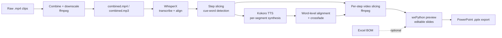

# Instruction Transcription Interface

A desktop application that turns **narrated assembly-instruction videos** into an
**editable, step-by-step PowerPoint deck** — with per-step video clips, cleanly
re-synthesized narration that stays time-aligned to the original footage, and
optional Bill-of-Materials (BOM) tables pulled from Excel.

Built for assembly/manufacturing documentation: record yourself building a part
while narrating ("*start step one … end step one*"), and the tool transcribes the
speech, splits the footage into discrete steps, regenerates studio-quality
narration, and assembles a presentation you can review, edit, and export.

---

## What it does

1. **Transcribes** the spoken narration with [WhisperX](https://github.com/m-bain/whisperX),
   producing word-level timestamps via forced alignment.
2. **Splits** the recording into discrete steps using spoken cue words
   (`start step …` / `end step …`).
3. **Re-narrates** each step with the [Kokoro-82M](https://github.com/hexgrad/kokoro)
   neural TTS voice, then **time-aligns the synthetic speech back onto the
   original word timings** (with crossfades) so the new audio matches the action
   on screen.
4. **Slices** the video into per-step clips (one with the regenerated narration,
   one with the original audio), optionally burning in subtitles.
5. **Extracts** component and tool tables from the project's Excel BOM (optional).
6. **Assembles** everything into an editable presentation and **exports to
   `.pptx`**, including embedded autoplay video and scrolling-caption overlays.

The narration text for any step can be edited in the UI and re-rendered on the
fly — the edit is diffed against the original transcript so per-word timings are
preserved.

---

## How it works



All media operations are performed through **direct `ffmpeg`/`ffprobe`
subprocess calls** (cut, scale, concat, audio-swap, subtitle burn) — keeping
memory bounded and avoiding per-frame work in Python.

---

## Screenshots

<!--
Drop screenshots into docs/screenshots/ and they'll render below.
Good ones to capture for a showcase:
  1. The main window with a project loaded and step slides in the notebook.
  2. A step being edited (narration text box + embedded video).
  3. An exported .pptx slide opened in PowerPoint.
-->

| Main window | Exported slide |
| --- | --- |
|  |  |

---

## Tech stack

| Area | Tools |
| --- | --- |
| Speech-to-text | WhisperX (faster-whisper + wav2vec2 forced alignment), Silero VAD |
| Text-to-speech | Kokoro-82M, misaki G2P, spaCy (`en_core_web_sm`) |
| ML runtime | PyTorch (CPU/int8) |
| Media | ffmpeg / ffprobe (invoked directly), soundfile |
| Desktop UI | wxPython |
| Presentation | python-pptx, Pillow |
| Data / BOM | pandas, openpyxl |
| Packaging | uv, PyInstaller (frozen `.exe`) |

---

## Project structure

| File | Responsibility |
| --- | --- |
| `transcription_interface.py` | wxPython GUI and pipeline orchestration (entry point). |
| `snippets.py` | Backend: transcription, step slicing, TTS + alignment, video slicing, BOM. |
| `wxSlides.py` | Presentation layer — wxPython ↔ python-pptx slide/shape model and `.pptx` export. |
| `test/check_pipeline.py` | Standalone capability check for the ML stages (see [Testing](#testing)). |
| `test/` | Sample fixtures (`combined.mp3`, `combined.json`, `Step0.json`). |

---

## Setup

**Requirements:** Python 3.12–3.13, [`uv`](https://docs.astral.sh/uv/), and
`ffmpeg`/`ffprobe` available on your `PATH`.

```bash
# Install dependencies into a managed virtual environment
uv sync
```

`uv sync` also installs the spaCy model `en_core_web_sm` (declared in
`pyproject.toml`), which Kokoro's English G2P requires.

---

## Usage

```bash
uv run python transcription_interface.py
```

In the window:

1. **Select the core folder** containing your `.mp4` recording(s) (and the `.xlsm`
   BOM, if using one). The app organizes the folder into `Videos/`, `BOM/`,
   `StepSegs/`, etc.
2. **Compress Video** — concatenate and downscale the clips into `combined.mp4`
   and extract the audio.
3. **Transcribe Steps** — run transcription → step slicing → TTS → per-step video
   rendering → slide assembly.
4. **Edit** any step's narration text in the preview, then **Rerender Steps** to
   regenerate just that step's audio/video.
5. **Save** to export the deck as a `.pptx`.

> Narration must include the spoken cues `start step …` and `end step …` to mark
> step boundaries.

---

## Testing

Before processing a real project, verify your machine can run the model-heavy
stages (Kokoro TTS + WhisperX) using the bundled fixtures:

```bash
uv run python test/check_pipeline.py                 # full run (distil-large-v3, as the app uses)
uv run python test/check_pipeline.py --quick         # Kokoro TTS only (skip WhisperX)
uv run python test/check_pipeline.py --whisper-model tiny   # fast smoke test
```

The script reports wall-clock time and peak RAM per stage and prints a PASS/FAIL
summary, so you can gauge whether a given laptop is up to the workload.

---

## Notes & limitations

- Transcription/TTS run on **CPU** by default; expect multi-second-per-step
  processing and roughly **3–4 GB peak RAM** with the default WhisperX model.
- Step detection is **cue-word based** — narration phrasing matters.
- The first run downloads the WhisperX and Kokoro-82M model weights.
